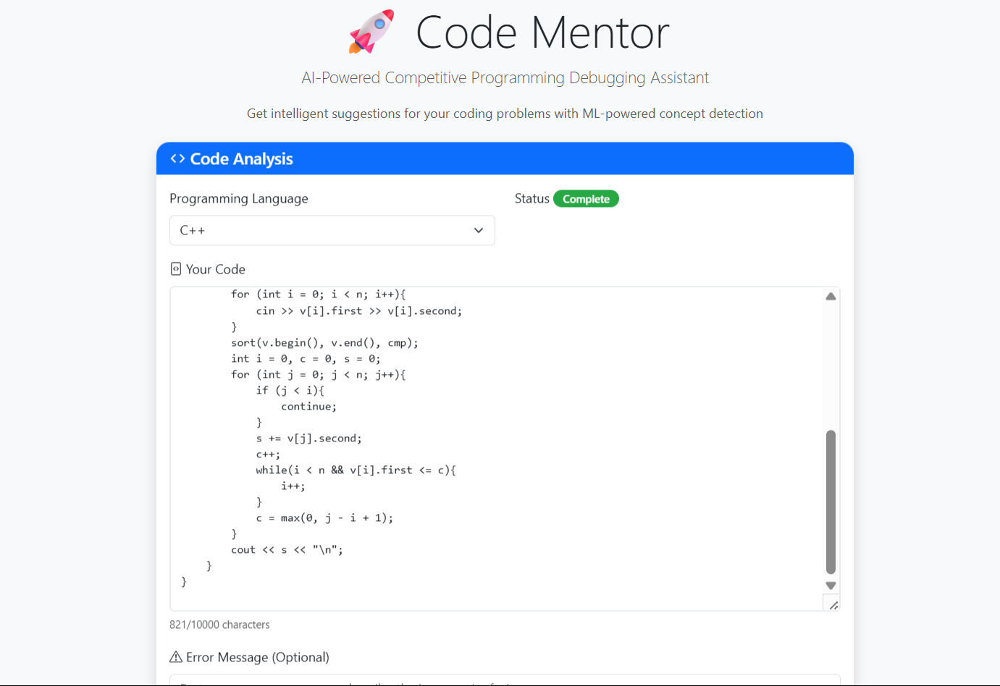

# 🚀 Code Mentor

**Code Mentor** is an intelligent assistant designed to help developers debug their competitive programming code by identifying the underlying concepts and providing targeted suggestions. Built with a clean full-stack architecture, it integrates a responsive frontend, powerful Flask backend, and persistent SQLite logging. The project is currently evolving to include Machine Learning and LLMs (e.g., OpenAI, LangChain) for smart feedback.

---

## 📸 Preview

### 🖼️ User Interface Screens




## ✨ Features

- ✅ Paste your **code** and **error** to get real-time analysis
- ✅ Auto-identify concept tags (e.g., Binary Search, DP — ML module coming soon)
- ✅ Clean and responsive **Bootstrap frontend**
- ✅ RESTful **Flask API backend**
- ✅ Submissions logged with **timestamped SQLite database**
- ✅ Modular design: easily add ML/LLM model logic later
- 🚀 Future: LLM integration with LangChain, OpenAI/Gemini for intelligent suggestions

---

## 🧰 Tech Stack

| Layer      | Tools Used                         |
|------------|------------------------------------|
| Frontend   | HTML5, CSS3, Bootstrap 5, JavaScript |
| Backend    | Python 3, Flask                    |
| Database   | SQLite 3                           |
| ML (soon)  | Scikit-learn, LangChain, OpenAI    |
| Deployment | Render / Vercel / GitHub Pages (planned) |

---

## 🧭 Project Structure

```
CODE-MENTOR/
├── app/                    # Main Flask application code
├── data/                   # (Optional) Data files or sample inputs
├── instance/               # Flask instance folder (e.g., for config or DB)
├── models/                 # Model or schema definitions
├── Screenshots/            # UI screenshots for documentation
├── venv/                   # Virtual environment (ignored by Git)
├── .env                    # Environment variables file
├── .gitignore              # Git ignore rules
├── README.md               # Project information
├── requirements.txt        # Python dependencies
└── run.py                  # Entry point to run the app

```

---

## ⚙️ How to Run Locally

1. **Clone the repository**
```bash
git clone https://github.com/YOUR_USERNAME/code-mentor-ai.git
cd code-mentor
```

2. **Install dependencies**
```bash
pip install -r requirements.txt
```

3. **Run the app**
```bash
python run.py
```

4. **Visit in browser**  
`http://localhost:5000`

---

## 🗃 Example Logs Stored

Each submission logs:
- 🧾 `code` (user input)
- ❌ `error` (user's error message)
- 🔍 `concept` (tagged concept like Binary Search)
- 💡 `suggestion` (next step hint)
- 🕒 `timestamp`

These are stored in `app/code_logs.db` for analytics & training.

---

## 🚧 Roadmap

- [x] Basic frontend with form
- [x] Flask backend API setup
- [x] SQLite DB logging system
- [ ] Admin/history page to view logs
- [ ] ML model for concept classification
- [ ] LangChain + LLM-based suggestion engine
- [ ] Auto-deployment on Render/Vercel
- [ ] Feedback/rating system from users

---

## 🧑‍💻 Author

**Rohit Singh**  
🎓 2nd-year student @ IIT Madras BS in Data Science & PW Institute of Innovation  
💡 Competitive Programmer | GATE CSE Aspirant | AI/ML & Backend Enthusiast  
📬 [LinkedIn] (https://www.linkedin.com/in/rohitsingh-/)  
🌐 [Portfolio] (https://itsrohit819.github.io/Portfolio/#)

---

## 📝 License

This project is under the [MIT License](LICENSE) — feel free to use, fork, and contribute!

---
